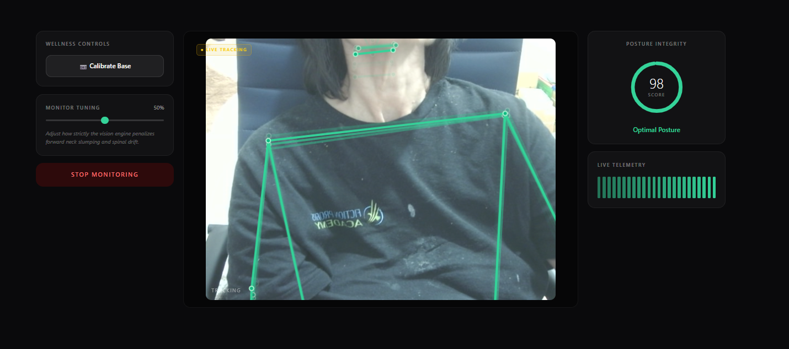

# Creative Ergonomist

A real-time, browser-based posture companion. Your webcam feeds a pose model that watches for forward-neck slumping and spinal drift, then scores your "Posture Integrity" live so you can catch yourself hunching before your back does.

Everything runs **locally in the browser** — the video never leaves your machine.



## Features

- **Live pose tracking** via [MediaPipe Tasks Vision](https://developers.google.com/mediapipe) (`PoseLandmarker`), rendered as a skeleton over a dimmed camera feed.
- **Posture Integrity score (0–100)** with a color-coded ring: green (optimal), yellow (minor drift), red (correct your posture).
- **Calibrate to your own baseline** — sit up straight, hit *Calibrate Base*, and the engine scores you relative to your good posture instead of a generic template.
- **Adjustable sensitivity** — the Monitor Tuning slider scales how strictly slumping and drift are penalized.
- **Live telemetry** — a rolling history bar so you can see your posture trend over time.
- **GPU-accelerated** with automatic CPU fallback.

## How scoring works

Each video frame, the engine reads the pose landmarks and computes three signals:

| Signal | What it measures | Weight |
| ------ | ---------------- | ------ |
| **Slump** | Forward-neck / downward head position vs. your calibrated baseline | 70% |
| **Tilt** | Head leveling (ear-to-ear height) | 15% |
| **Lean** | Shoulder leveling (shoulder-to-shoulder height) | 15% |

Each signal has a deadzone so natural asymmetry and a non-level webcam don't register as drift. The penalty is subtracted from 100, smoothed across frames, and mapped to:

- **85–100** → Optimal Posture (green)
- **60–84** → Minor Drift (yellow)
- **below 60** → Correct Your Posture (red)

## Tech stack

- [React](https://react.dev/) + TypeScript
- [@mediapipe/tasks-vision](https://www.npmjs.com/package/@mediapipe/tasks-vision) for on-device pose estimation
- Plain `<canvas>` 2D rendering for the skeleton overlay — no extra render libraries

## Getting started

> Requires [Node.js](https://nodejs.org/) 18+ and a webcam.

```bash
# install dependencies
npm install

# run the dev server
npm run dev
```

Then open the local URL the dev server prints (usually `http://localhost:5173`), click **Start Monitoring**, and allow camera access when prompted.

> **Tip:** position your camera so your head *and both shoulders* are clearly in frame, then click **Calibrate Base** while sitting up straight. The model places body landmarks where it thinks your body is — if your shoulders are out of view, the skeleton won't track correctly.

## Project structure

```
src/
  App.tsx        # everything: camera setup, pose loop, scoring, UI
```

The model and WASM runtime are loaded from a CDN at runtime, so keep the version pinned in `App.tsx` (`@mediapipe/tasks-vision@0.10.14`) matching your `package.json`.

## Pushing to GitHub

If you haven't connected this folder to the remote yet:

```bash
git init
git add .
git commit -m "Initial commit"
git branch -M main
git remote add origin https://github.com/bonosa/creative-ergonomist.git
git push -u origin main
```

If the remote already exists and you just want to update the URL:

```bash
git remote set-url origin https://github.com/bonosa/creative-ergonomist.git
```

## Privacy

All processing happens client-side in your browser. No video, image, or pose data is uploaded or stored anywhere.

## License

MIT — do what you like, no warranty.
